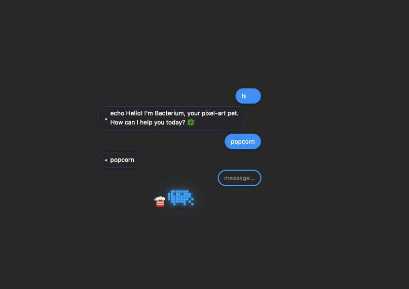

# DesktopPet

A pixel-art desktop companion that lives in a transparent overlay on your screen — wanders around, sits on window title bars, reacts to what you're doing, and even chats with you.



> Chat with your pet, spawn toys, and watch it react to your workflow in real time.

## Install

Open Terminal and run:

```bash
bash <(curl -fsSL https://raw.githubusercontent.com/acabelloj/desktop-pet-releases/main/install.sh)
```

That's it. The pet starts immediately and launches automatically on login.

---

## "App can't be opened" / Gatekeeper warning

You may see a macOS warning like:

> **"DesktopPet" can't be opened because Apple cannot check it for malicious software.**

**This is expected.** Here's why and how to fix it.

### Why this happens

macOS Gatekeeper requires apps to be signed with an Apple Developer ID certificate and notarized by Apple before they run without warnings. This is a paid program ($99/year) that we haven't set up yet for this early alpha.

The app itself is safe — it's a pixel pet that draws on a transparent overlay window. No network access, no data collection.

### The installer handles this automatically

The install script already runs `xattr -dr com.apple.quarantine` on the binary, which clears the quarantine flag macOS sets on downloaded files. **You shouldn't need to do anything manually.**

If you downloaded the binary directly (not via the install script), run this once:

```bash
xattr -dr com.apple.quarantine ~/Downloads/DesktopPet
```

### If you still see a warning after installing

1. Open **System Settings → Privacy & Security**
2. Scroll down to the Security section
3. You'll see: *"DesktopPet was blocked from use because it is not from an identified developer"*
4. Click **Open Anyway**

---

## Uninstall

```bash
launchctl bootout gui/$(id -u)/com.desktoppet.app 2>/dev/null || true
rm -f ~/Library/LaunchAgents/com.desktoppet.app.plist
rm -f ~/.local/bin/DesktopPet
```

---

## Requirements

- macOS 13 (Ventura) or later
- Apple Silicon (M1 or later)

